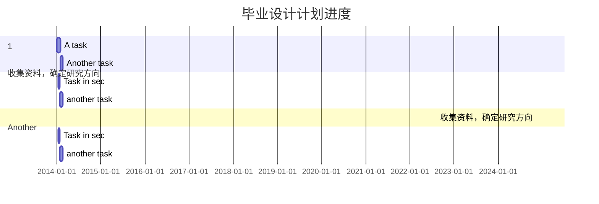

```mermaid
gantt
    title 毕业设计计划进度
    dateFormat  YYYY-MM-DD
    
    section 收集资料，确定研究方向
    A task           :a1, 2014-01-01, 30d
    Another task     :after a1  , 20d
    section Another
    Task in sec      :2014-01-12  , 12d
    another task      : 24d


    section 1
    收集资料，确定研究方向           : 2024-11-10, 

    section Another
    Task in sec      :2014-01-12  , 12d
    another task      : 24d
```