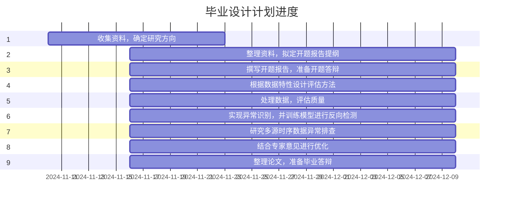

```mermaid
gantt
    title 毕业设计计划进度
    dateFormat  YYYY-MM-DD
    


    section 1
    收集资料，确定研究方向           : 2024-11-10  , 13d
    section 2
    整理资料，拟定开题报告提纲       : 2024-11-16  , 24d
    section 3
    撰写开题报告，准备开题答辩       : 2024-11-16  , 24d
    section 4
    根据数据特性设计评估方法         : 2024-11-16  , 24d
    section 5
    处理数据，评估质量               : 2024-11-16  , 24d
    section 6
    实现异常识别，并训练模型进行反向检测    : 2024-11-16  , 24d
    section 7
    研究多源时序数据异常排查         : 2024-11-16  , 24d
    section 8
    结合专家意见进行优化             : 2024-11-16  , 24d
    section 9
    整理论文，准备毕业答辩           : 2024-11-16  , 24d


```